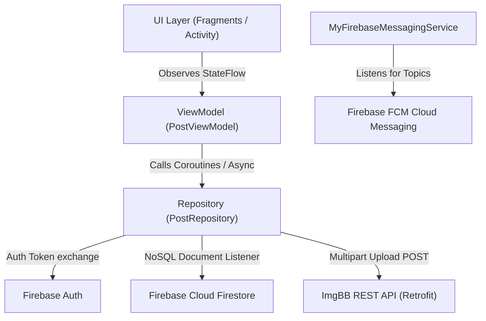
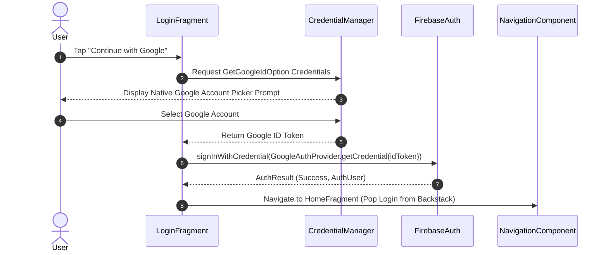
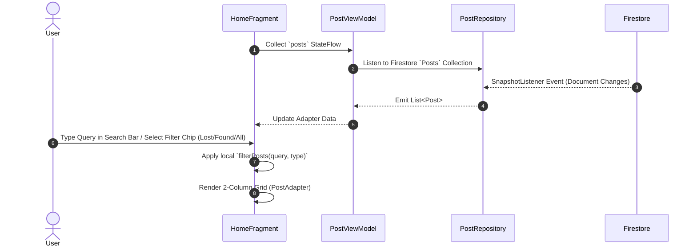
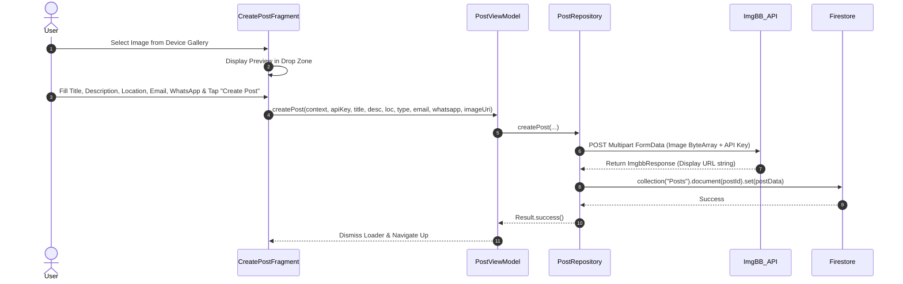
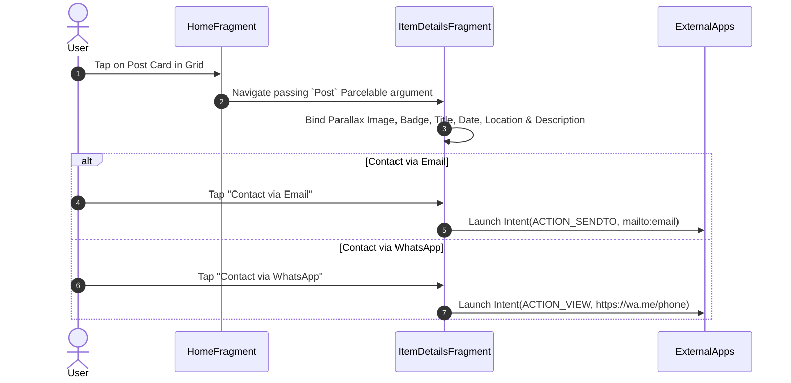
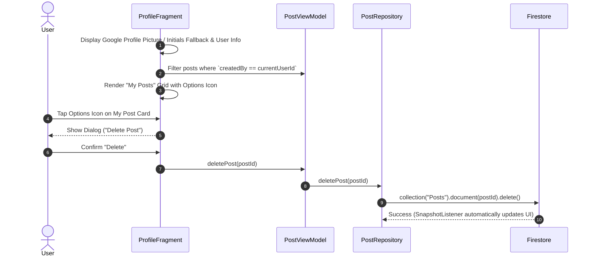

# 📚 CampusFind — Complete End-to-End Workflow Documentation

Welcome to the comprehensive workflow documentation for **CampusFind**. This document details the technical architecture, data flows, user journeys, data models, API integrations, directory structure, and deployment processes.


## 📋 Table of Contents
1. [System Architecture Overview](#1-system-architecture-overview)
2. [End-to-End User Workflows](#2-end-to-end-user-workflows)
   - [2.1 Authentication Workflow (Google Sign-In)](#21-authentication-workflow-google-sign-in)
   - [2.2 Home Feed & Real-Time Filtering Workflow](#22-home-feed--real-time-filtering-workflow)
   - [2.3 Post Creation & Image Upload Workflow](#23-post-creation--image-upload-workflow)
   - [2.4 Item Details & Contact Workflow](#24-item-details--contact-workflow)
   - [2.5 User Profile & Post Management Workflow](#25-user-profile--post-management-workflow)
   - [2.6 Push Notification Workflow](#26-push-notification-workflow)
3. [Data Schema & Model Specification](#3-data-schema--model-specification)
4. [Third-Party Integrations & API Setup](#4-third-party-integrations--api-setup)
5. [Directory & File Structure](#5-directory--file-structure)
6. [Build, Testing & Deployment Workflow](#6-build-testing--deployment-workflow)

## 1. System Architecture Overview

CampusFind follows the standard **MVVM (Model-View-ViewModel)** architectural pattern recommended by Google Android Guidance, leveraging **Android Jetpack** components, **Kotlin Coroutines**, **StateFlow**, and **Firebase Cloud Infrastructure**.



### Architecture Components:
- **UI Layer (`com.sezanx.campusfind.ui`)**: Declarative ViewBinding fragments (`HomeFragment`, `ProfileFragment`, `CreatePostFragment`, `ItemDetailsFragment`, `LoginFragment`).
- **ViewModel Layer (`com.sezanx.campusfind.viewmodel`)**: `PostViewModel` manages application UI state and handles coroutine scopes for asynchronous network operations.
- **Repository Layer (`com.sezanx.campusfind.repository`)**: `PostRepository` acts as the single source of truth for Firestore queries, ImgBB uploads, and data manipulation.
- **Network Layer (`com.sezanx.campusfind.repository.ImgbbService`)**: Retrofit interface for multipart image uploading to ImgBB.
- **Service Layer (`com.sezanx.campusfind.service`)**: `MyFirebaseMessagingService` handles incoming push notifications when new items are posted.


## 2. End-to-End User Workflows

### 2.1 Authentication Workflow (Google Sign-In)



- **Credential Manager Integration**: Android 14+ native `CredentialManager` API requests `GetGoogleIdOption`.
- **Firebase Authentication**: Exchanged Google ID token generates a `FirebaseUser` session.
- **Session Persistence**: Subsequent app launches skip the login screen automatically if `FirebaseAuth.getInstance().currentUser != null`.

---

### 2.2 Home Feed & Real-Time Filtering Workflow



- **Real-Time Data Sync**: Firestore `addSnapshotListener` automatically pushes updates to all connected devices without manual refreshing.
- **Instant Filtering**: Search inputs and filter chips evaluate on-device in real time over the `StateFlow` collection.


### 2.3 Post Creation & Image Upload Workflow




### 2.4 Item Details & Contact Workflow



### 2.5 User Profile & Post Management Workflow



### 2.6 Push Notification Workflow

1. User toggles **Push Notifications** switch in `ProfileFragment`.
2. App subscribes/unsubscribes to FCM topic: `FirebaseMessaging.getInstance().subscribeToTopic("all_posts")`.
3. When a new post event is published, `MyFirebaseMessagingService` captures `onMessageReceived` and displays a native Android system notification tray alert.

## 3. Data Schema & Model Specification

### Firestore Document Schema (`Posts` Collection)

| Field Name | Type | Description |
| :--- | :--- | :--- |
| `postId` | `String` | Unique UUID string generated upon creation |
| `title` | `String` | Title of the lost/found item |
| `description` | `String` | Detailed description of the item and context |
| `location` | `String` | Specific campus location (e.g., "Library 2nd Floor") |
| `type` | `String` | `"Lost"` or `"Found"` |
| `imageUrl` | `String` | Secure HTTP URL hosted on ImgBB |
| `createdBy` | `String` | Firebase User UID of the poster |
| `contactEmail` | `String` | Contact email address provided by the user |
| `whatsapp` | `String` | Phone/WhatsApp number (optional) |
| `date` | `Timestamp` | Firestore Server Timestamp of creation |

## 4. Third-Party Integrations & API Setup

### ImgBB API Integration
- **Endpoint**: `https://api.imgbb.com/1/upload`
- **Method**: `POST` (Multipart / Form Data)
- **Parameters**: `key` (API Key), `image` (Base64 or Multipart Body)
- **Response Model**: `ImgbbResponse` -> `data.url`

### Firebase Suite
- **Firebase Auth**: Google Identity Services integration.
- **Cloud Firestore**: NoSQL realtime document store with test mode security rules.
- **Firebase Messaging (FCM)**: Push notification delivery service.

## 5. Directory & File Structure

```text
CampusFind/
├── app/
│   ├── build.gradle.kts                # App-level dependencies & plugins
│   └── src/
│       └── main/
│           ├── AndroidManifest.xml     # Manifest declarations & permissions
│           ├── java/com/sezanx/campusfind/
│           │   ├── MainActivity.kt     # Main Activity container & BottomNav listener
│           │   ├── MyFirebaseMessagingService.kt # Push notification service
│           │   ├── model/
│           │   │   └── Post.kt         # Data model parcelable class
│           │   ├── repository/
│           │   │   ├── ImgbbService.kt # Retrofit interface for ImgBB upload
│           │   │   └── PostRepository.kt # Firestore & ImgBB data handling
│           │   ├── ui/
│           │   │   ├── CreatePostFragment.kt # Post creation form
│           │   │   ├── HomeFragment.kt       # Grid feed & filtering
│           │   │   ├── ItemDetailsFragment.kt# Item details & contact buttons
│           │   │   ├── LoginFragment.kt      # Google Auth login
│           │   │   ├── PostAdapter.kt        # RecyclerView adapter for 2-column grid
│           │   │   └── ProfileFragment.kt    # User profile & My Posts manager
│           │   └── viewmodel/
│           │       └── PostViewModel.kt  # Coroutine state management
│           └── res/
│               ├── drawable/             # Drawables, shapes, app_logo PNG
│               ├── layout/               # ViewBinding XML layouts
│               ├── menu/                 # bottom_nav_menu.xml
│               ├── mipmap-*/             # Launcher icons (ic_launcher.png)
│               ├── navigation/           # nav_graph.xml
│               └── values/               # colors.xml, themes.xml, strings.xml
├── build.gradle.kts                    # Root gradle configuration
├── settings.gradle.kts                 # Gradle repository repositories
├── README.md                           # Quickstart guide
└── WORKFLOW.md                         # Complete workflow documentation
```

## 6. Build, Testing & Deployment Workflow

### Build Commands
- **Assemble Debug Build**:
  ```bash
  ./gradlew assembleDebug
  ```
- **Assemble Release Build**:
  ```bash
  ./gradlew assembleRelease
  ```

### Release Deployment Steps
1. Generate signed APK or App Bundle (`.aab`) in Android Studio via `Build > Generate Signed Bundle / APK`.
2. Create a tag in Git:
   ```bash
   git tag -a v1.0.0 -m "Initial Release v1.0.0"
   git push origin v1.0.0
   ```
